  <picture>
    <source media="(prefers-color-scheme: dark)" srcset="assets/banner-minimal.svg" />
    <source media="(prefers-color-scheme: light)" srcset="assets/banner-minimal-light.svg" />
    
  </picture>

I build **web and desktop applications**, **developer tools**, and things that turn code into something you can see and play with.

Most of it is TypeScript, Electron, and real-time graphics: a shader workspace, a game engine with its own level editor, and a set of small, hardened building blocks for Electron apps.

  <a href="https://github.com/antelm-dev?tab=repositories">Repositories ↗</a>
  &nbsp;·&nbsp;
  <a href="https://adel-terki.fr">adel-terki.fr ↗</a>
  &nbsp;·&nbsp;
  <a href="https://www.linkedin.com/in/adel-terki-6116861b5/">LinkedIn ↗</a>

## Creative coding

### [Shadergrove](https://github.com/antelm-dev/shadergrove)

**A workspace for building, tuning, and collecting WebGL shaders.**

Edit GLSL with live previews and compiler diagnostics, generate interactive controls, and keep shaders and presets in a portable library. Available on the web and as an Electron desktop app.

`Angular` · `NestJS` · `Electron` · `GLSL / WebGL`

[Explore the code →](https://github.com/antelm-dev/shadergrove) &nbsp;·&nbsp; [Read the user guide →](https://github.com/antelm-dev/shadergrove/wiki)

---

### [mmx.ts](https://github.com/antelm-dev/mmx.ts) + [MMX Studio](https://github.com/antelm-dev/mmx-studio)

**A faithful port. A deterministic engine. A studio to build on it.**

mmx.ts is a TypeScript port of Mega Man X core gameplay on a deterministic engine. MMX Studio is the Electron + React level editor that sits on top: inspect, place, and edit every level entity, then play-test instantly with the real engine and Pixi renderer.

`TypeScript` · `Pixi.js` · `Electron` · `React`

[Explore the engine →](https://github.com/antelm-dev/mmx.ts) &nbsp;·&nbsp; [Explore the studio →](https://github.com/antelm-dev/mmx-studio)

---

### [tetris.ts](https://github.com/antelm-dev/tetris.ts)

**Classic rules. A different dimension.**

A 3D Tetris built with TypeScript and p5.js / WebGL. One game engine powers both the browser and Electron versions, with multiple game modes and a local versus bot.

`TypeScript` · `p5.js` · `WebGL` · `Electron`

[Explore the code →](https://github.com/antelm-dev/tetris.ts)

## Practical tools

Small, focused packages for building secure Electron apps. Each one works on its own; the template wires them together.

| Package | What it does | |
| --- | --- | --- |
| [electron-ipc-module](https://github.com/antelm-dev/electron-ipc-module) | Declare handlers in main, get a typed preload bridge generated for you. Module lifecycle, Rollup / Vite integration. |  |
| [electron-renderer-protocol](https://github.com/antelm-dev/electron-renderer-protocol) | A hardened custom protocol for serving the renderer bundle: path-traversal protection, CSP defaults, SPA fallback. |  |
| [vite-plugin-electron-run](https://github.com/antelm-dev/electron-run) | Electron dev loop for Vite: builds main and preload, restarts cleanly on change. |  |
| [electron-app-template](https://github.com/antelm-dev/electron-app-template) | Lightweight starter that combines the three above with electron-builder and Electron fuses. | [Use this template →](https://github.com/antelm-dev/electron-app-template/generate) |

`TypeScript` · `Electron` · `Vite` · `Developer tooling`
