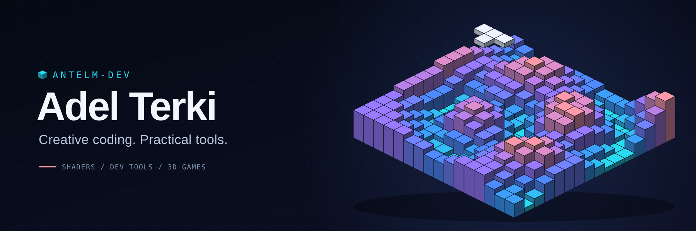
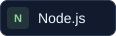

  

I build **web and desktop applications**, **developer tools**, and things that turn code into something you can see and play with.

My projects bring together TypeScript, Electron, and real-time graphics: a shader workspace, a typed IPC library, and a 3D take on Tetris.

  <a href="https://github.com/antelm-dev?tab=repositories">Explore my repositories ↗</a>
  &nbsp;·&nbsp;
  <a href="https://www.linkedin.com/in/adel-terki-6116861b5/">Connect on LinkedIn ↗</a>

## What I'm building

### [Shadergrove](https://github.com/antelm-dev/shadergrove)

**A workspace for building, tuning, and collecting WebGL shaders.**

Edit GLSL with live previews and compiler diagnostics, generate interactive controls, and keep shaders and presets in a portable library. Available on the web and as an Electron desktop app.

`Angular` · `NestJS` · `Electron` · `GLSL / WebGL`

[Explore the code →](https://github.com/antelm-dev/shadergrove) &nbsp;·&nbsp; [Read the user guide →](https://github.com/antelm-dev/shadergrove/wiki)

---

### [electron-ipc-module](https://github.com/antelm-dev/electron-ipc-module)

**Declare once. Keep the bridge typed.**

A modular Electron IPC library that generates a typed preload bridge from main-process handlers. Includes module lifecycle management and Rollup / Vite integration.

`TypeScript` · `Electron` · `Developer tooling`

[Explore the code →](https://github.com/antelm-dev/electron-ipc-module) &nbsp;·&nbsp; [Get the npm package →](https://www.npmjs.com/package/electron-ipc-module)

### [tetris.ts](https://github.com/antelm-dev/tetris.ts)

**Classic rules. A different dimension.**

A 3D Tetris built with TypeScript and p5.js / WebGL. One game engine powers both the browser and Electron versions, with multiple game modes and a local versus bot.

`TypeScript` · `p5.js` · `WebGL` · `Electron`

[Explore the code →](https://github.com/antelm-dev/tetris.ts)

## Tools I work with

  
  
  
  
  

## Say hello

Interested in shader tools, Electron, or creative coding? [Let's connect on LinkedIn.](https://www.linkedin.com/in/adel-terki-6116861b5/)
